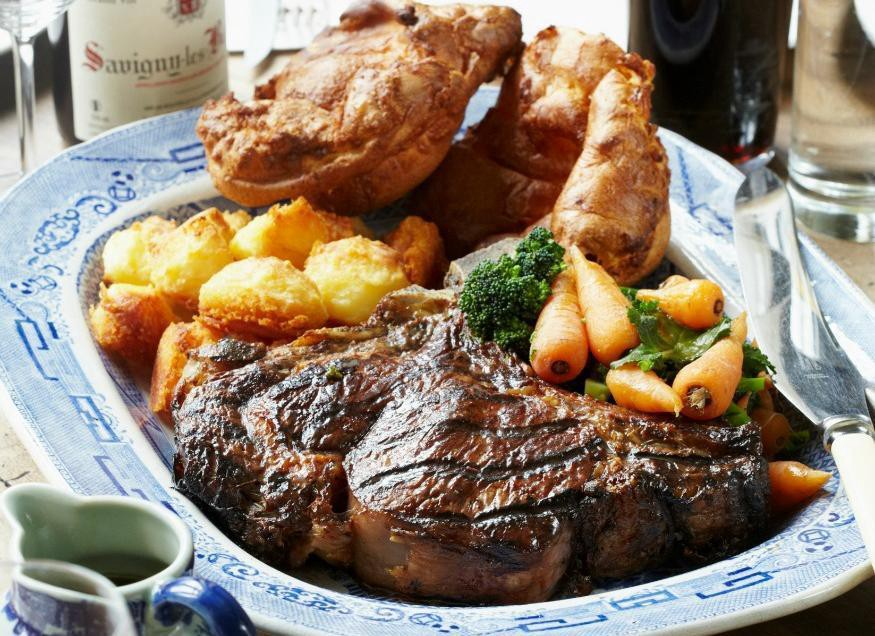

The ultimate guide to cooking a Sunday roast alone with only one oven

“Dad help I need to cook a Sunday roast for 10 people and I can’t figure out how this is going to work with just one oven” — my cry echoed down the phone. After the laughter at my being a pauper who can only afford one oven subsided I got some solid Dad wisdom on the subject, which i’ve recorded here.

This plan aims to use at most 3 oven shelves (maybe 2 at a push) and will give you timings to produce the following for 10 people:

-   Beef joint (I used a 2kg Sirloin instead of a Rib joint)
-   Yorkshire Puddings
-   Roast potatoes
-   Broccoli / greens
-   Honeyed Carrots

Wherever possible tasks are done early, to leave you free-ish for entertaining once your guests begin to arrive.

### Other things you might need

-   Food ingredients as above
-   Chopping board with juice track [\[Amazon\]](https://amzn.to/2Op3A3S)
-   Gravy Separator [\[Amazon\]](https://amzn.to/2PC3fQe)
-   Roasting tins (multiple) [\[Amazon\]](https://amzn.to/2PGP4cv)
-   Veal stock (any kind of stock but this is my favourite) — enough to make at least a litre.

### When do i need to start work?

First thing in the morning: Get the beef out of the fridge/from the butcher and leave it on the side so it starts approaching room temperature.

About 3.5 hours before you want to be serving, perform the following tasks. I’m going to pretend that i’m starting at 11am, to serve at 2pm. Adjust times for your own situation.

**10:30 **— Peel your potatoes. I used some Maris pipers for this, drop them into a pan of water so they stay fresh until you want to start cooking them.

It probably won’t hurt to chop your broccoli into florets at this point / prepare any other greens you want to add (like some green beans).

**11:00** \[Oven to 220ºc\] — Make the yorkshire pudding mix. We’re going to cook these bad boys first and get them out the way, they can be quickly reheated later and served with no one the wiser and no ill effects. Don’t try and cheat around this, if you try and do potatoes and yorkies together, they get soggy and regrettable.

Prepare and cook from [yorkshire puddings recipe](https://www.bbcgoodfood.com/recipes/9020/best-yorkshire-puddings) (adjust for number of people).

**11:30 **— assuming those yorkshires are in the oven by now. Get some carrots and chop them vertically, then half them so you’ve got something vaguely baton-y. Prepare a roasting tin for them with goose fat. [Example honeyed carrots recipe for reference.](https://www.bbcgoodfood.com/recipes/1161636/honeyglazed-roast-carrots)

**11:40** — Line a roasting tin with goose fat for the roasties, be very generous for optimal crispy goodness. Put to one side.

**11:50ish **— After the prep and the recommended 20–25 minutes cooking your yorkshires should be coming out of the oven. Put them on the side somewhere to cool / sit until they’re ready to be reheated at the very end. Turn the over down to ~180ºC for the meat.

**12:00** \[Oven at 180ºC\] — I used a ~2kg Sirloin joint instead of a Rib, I find it makes carving less of a hassle. Before putting in the oven i rubbed in a couple of healthy handfuls of salt and pepper and threw two halved onions in the bottom for gravy flavour. Cooking instructions on the joint told me to cook it at ~180ºC for about 1h40 minutes. I’m starting at 12pm because it’s [critical that you rest your meat](https://blog.thermoworks.com/beef/give-your-meat-a-rest/) before serving for best taste.

Remember the string stays on until you’re about to carve.

Start boiling your potatoes, you’re going for a par boil followed by a long roast, mostly along [these lines](https://www.bbcgoodfood.com/recipes/1303/ultimate-roast-potatoes). For now do the par boil, and get ready to put them in a tray.

**12:25** — Put the tin for the roasties in the oven with just the goose fat in to get it good and hot. Don’t change the temperature or disturb the beef.

**12:40** — Complete the par boil as the recipe describes (shake the sauce pan a bit to fluff up edges). Remove the roasting tin and relatively quickly dump the drained and fluffed up potatoes into the pan, watch out for jumping goose fat.

Use a spatula or a tossing motion if you’re feeling like flairing it up to make sure the potatoes are as coated with oil as possible (to ensure all sides crisp up).

Put those bad boys in the oven, they’ll be there for over an hour.

**12:50** —Put the carrots in too (and now we’re using all 3 of our shelves).

**13:25** —Mix your powdered stock with water to make at least 1 litre of stock. It’s ok if this cools a bit, we’ll warm it later.

**13:30** — Prepare some water to boil/steam your vegetables.

**13:35** — Turn the oven up to 220ºC — the beef’s not coming out yet but lets start pre-heating.

_— Things are about to move quite quickly for this last part —_

**13:40** — Take the beef out, transfer to a chopping board with a track to catch all the juice. Get some tin foil and wrap it around completely leaving the bottom bare (wrapped around the sides and top only). This is going to rest for 20 minutes. You can push this to 30 minutes or (slightly drastic) to 40 minutes if other things aren’t running to time. Under no circumstances slice the meat before resting.

Potatoes and carrots, still in the oven. We’re going to give them 20 minutes at 220ºC

Start boiling/steaming your vegetables. Prepare serving dishes/trays for everything (potatoes, veg, carrots) if you haven’t already.

**13:41 — **Mix your liquid stock with the onions and juice from the beef, get this pan on the hob with the heat on it so it can reduce as much as possible before we serve it.

**13:55 **— Seat your guests, move the beef upstairs at this point if you want.

**14:00 — **Get the potatoes and carrots out, put them in a serving dish using a [slotted spoon](https://amzn.to/2D1T6p1) so no oil transfers. Your veg should be cooked, bowl it up.

Move the gravy from the roasting pan on the hob to a [gravy separator](https://amzn.to/2D0MuY4), and from the separator to a gravy boat or two.

Go time — get everything to the table ASAP and enjoy.

Remove the string from the beef, start carving it into thin slices whilst everyone helps themselves to potatoes and vegetables. Careful when moving the chopping board as it’ll be juicy. It’s good to have some paper towels to hand in case any juice escapes.

### Wrapping up

Success! Hopefully… please feel free to post comments saying how this went or inline comments with suggestions on how I can make this ultimate guide to cooking a roast with one oven even more ultimate.