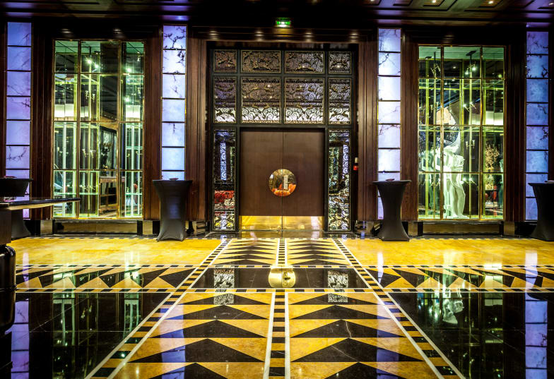

Recently a friend was desperately trying to find a hotel in Paris, for reasons unknown lastminute.com choose to declare some hotels 'top secret hotels', obscure their images and not tell you exactly where they are on the map... remarkably inconvenient for someone looking for a hotel.

So we asked the question, can you defuzz a top secret hotel image and find out where it really is?

The answer (at least at time of writing) is yes. Here's the guide:

  - Open the top secret hotel's page on lastminute.com, you'll see a fuzzed image at the top that looks like this: 
  
  - To get the URL of this image right-click -> inspect to open the raw HTML in your browser's development tools window
  
  - Expand the `
` tag and all child divs within it until you get to the image URL - hosted at `res.cloudinary.com`:
  
  
  - Taking the URL shown in the screenshot as an example. `//res.cloudinary.com/lastminute/image/upload/t_OSE_det_tsh_gall/q_auto/v1430218174/Foyer_Normandie_-_Hotel_du_Collectionneur_duvo7n.jpg` - prepend `https://` and view it. 
  
     https://res.cloudinary.com/lastminute/image/upload/t_OSE_det_tsh_gall/q_auto/v1430218174/Foyer_Normandie_-_Hotel_du_Collectionneur_duvo7n.jpg
  
  - It's fuzzed, as you might expect. Luckily defuzzing isn't super hard. In the URL you'll notice this section `/t_OSE_det_tsh_gall/` - the _tsh_ indicates this is a Top Secret Hotel link. To defuzz the image take the same link, remove '_tsh_' and profit. 
  
  - The new defuzzed link from this example is: 
  
     https://res.cloudinary.com/lastminute/image/upload/t_OSE_det_gall/q_auto/v1430218174/Foyer_Normandie_-_Hotel_du_Collectionneur_duvo7n.jpg
  
  
  
  - You can now right-click and 'search google for this image' (reverse image search) and it's highly likely that the top results in image search will be for the hotel you're looking for.
  
You'll notice that in this case the name of the hotel was actually in our demo link - the _Foyer Normandie Hotel du Collectionneur_. This is not always the case (hence the advice to reverse image search).

Enjoy!