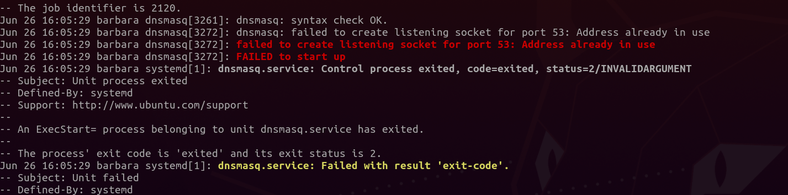

Whilst installing Streisand on Ubuntu 20.04 I came across this error related to dnsmasq. Luckily it's simple to solve.



See what's listening:

```
sudo netstat -tulpn | grep ":53 "
```

There's something hogging our port! Result:

```
tcp        0      0 127.0.0.53:53           0.0.0.0:*               LISTEN      582/systemd-resolve 
udp        0      0 127.0.0.53:53           0.0.0.0:*                           582/systemd-resolve
```

Kill this out of the box Ubuntu service:

```
# sudo systemctl disable systemd-resolved
Removed /etc/systemd/system/multi-user.target.wants/systemd-resolved.service.
Removed /etc/systemd/system/dbus-org.freedesktop.resolve1.service.
# sudo systemctl stop systemd-resolved
```

Since you've nuked the built in DNS service head over to `/etc/resolv.conf` and change `nameserver 127.0.0.53` to something else, such as your local router's IP or 8.8.8.8 (Google) or 1.1.1.1 (Cloudflare).

Retry streisand install, done.